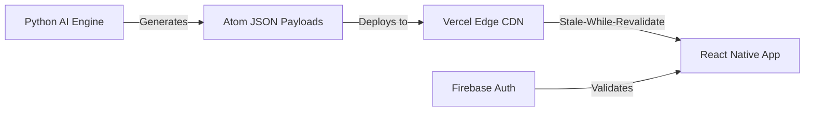

# Scrolla: The Mobile Learning Engine

Scrolla is a dopamine-optimized, TikTok-style learning engine designed to break complex technical topics into bite-sized "Atoms". Engineered for extreme performance and deep focus, it seamlessly integrates fluid animations, generative aesthetic designs, and offline-first edge caching.

## 🚀 Project Architecture

The Scrolla ecosystem operates on a fully decoupled, serverless architecture split into three core layers:



1. **The Python Engine (`engine/` & `containers/`)**
   - An automated pipeline that prompts local or remote LLMs to ingest vast knowledge bases (like PDFs or git repos) and chunk them into highly structured, educational JSON arrays known as "Roadmaps".
2. **The Serverless CDN (`scrolla-content/`)**
   - The generated JSON files act as a static, flat-file database. Deployed to Vercel, this repository acts as a globally distributed CDN, ensuring 0ms network resolution and entirely removing the need for a traditional monolithic SQL backend.
3. **The Mobile Application (`application/`)**
   - A highly optimized React Native (Expo) mobile client that consumes the CDN payloads, heavily caches them using `AsyncStorage`, and renders them via native APIs (using Expo Image, Lottie, and BlurView). It employs Firebase Authentication to handle user sessions.

## 📂 Repository Structure

```text
scrolla/
├── application/        # React Native (Expo) App Source Code (See application/README.md)
├── containers/         # Configuration files guiding the AI Engine's knowledge extraction
├── engine/             # The Python LLM pipeline and roadmap-generation logic
├── scrolla-content/    # The JSON Database repository (pushed to Vercel)
├── CHANGELOG.md        # Detailed history of development phases and architectural updates
└── README.md           # This file
```

## 🛠️ The Atom Protocol

Scrolla enforces a strict cognitive structure known as the **Atom Protocol**. To prevent cognitive overload, the LLM pipeline enforces the following constraints on every generated JSON object:
*   **Explanation**: Core definition delivered in under 30 words.
*   **Mental Model**: A vivid, intuitive analogy to instantly "rewire" understanding.
*   **Code/Example**: Concrete, syntax-highlighted execution.
*   **Pitfall**: A warning of the most common mistake made by beginners.
*   **Quick Check**: A fast, interactive question to validate immediate retention.

## 📖 Getting Started

To run the mobile application, navigate into the `application` folder and refer to the exhaustive developer guide:
[👉 Read the Mobile App Developer Guide (application/README.md)](application/README.md)
